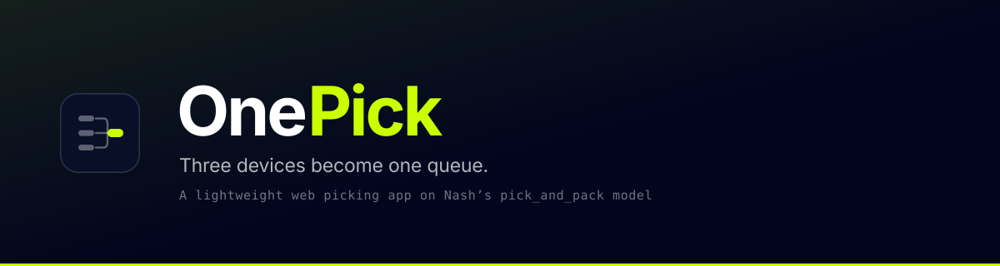
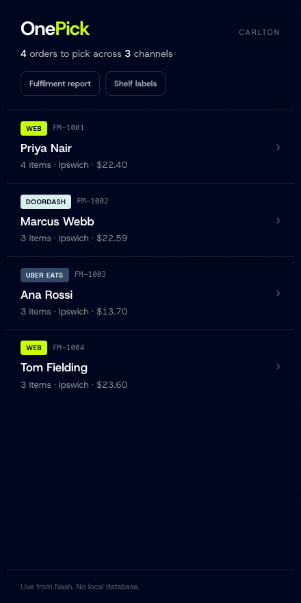

A lightweight web picking app for FreshMart, built on Nash's `pick_and_pack` model.

**Live:** https://onepick-production.up.railway.app
**Health:** https://onepick-production.up.railway.app/api/health
**Docs:** https://shawn-dsz.github.io/nash-picker/

---



## One run, start to finish

Recorded against the live sandbox, not a mockup. Fifteen seconds, one order,
and every screen in it is real.

The picker opens the queue, walks to the shelf, weighs a kilo of bananas that
comes out at **0.94kg**, and reaches for a Diet Coke. They scan a Coca-Cola
Classic by mistake and **the app stops them** - naming what they are holding and
what they actually need. The run closes at **98% fill**, written back to Nash.

Nothing in that flow is staged. The order it finishes is a real order in the
sandbox, and `pick_status: items_pick_complete` is read back from the platform
rather than shown as a success message.

Re-record it any time with `demo/beats.mjs`, which drives the same five beats
against production. The UI changes, so the recording has to be re-runnable.

<br clear="all">

---

## The problem

A picker in a FreshMart store today carries three devices - one for Uber, one for
DoorDash, one for the first-party site. Three queues, three interfaces, and no
single view of what the store owes anyone.

> "Orders come from multiple channels managed on different systems. Our pickers
> juggle multiple screens and we have no unified view of fulfillment."

**OnePick is one web app, one queue, one device.**

---

## The one decision everything else follows from

Nash already models picking end to end. The exercise's four scenarios map exactly
onto statuses that already exist:

| Scenario | Nash status |
|---|---|
| Mark picked | `picked` |
| Partial quantity | `partially_picked` |
| Out of stock | `not_picked` |
| Substitution | `substituted` |

So this is a **mapping problem, not a domain design problem**. OnePick drives
Nash's model rather than inventing a parallel one, which is also why it is
**stateless** - there is no database, Nash holds the state, and closing the tab
loses nothing.

---

## Docs

Read in this order. The HTML ones are published at
**https://shawn-dsz.github.io/nash-picker/** - open them there, because GitHub
serves raw source for `.html` rather than rendering it.

| | |
|---|---|
| [`plan.html`](https://shawn-dsz.github.io/nash-picker/plan.html) | The shareable one-pager. Problem, scope, storyline, metrics |
| [`dataflow.html`](https://shawn-dsz.github.io/nash-picker/dataflow.html) | Where every field comes from and where every outcome goes |
| [`json-flow.html`](https://shawn-dsz.github.io/nash-picker/json-flow.html) | One sub-item through six calls |
| [`docs/PICKER-GUIDE.md`](docs/PICKER-GUIDE.md) | How the app is used on the shop floor. Written for the picker, not the developer |
| [`docs/ARCHITECTURE.md`](docs/ARCHITECTURE.md) | The shape, key decisions, analytics, NFRs, tradeoffs, current state |
| [`docs/SCOPE.md`](docs/SCOPE.md) | What is built, what is stretch, what is deliberately not built - and what would change my mind |
| [`docs/DECISIONS.md`](docs/DECISIONS.md) | D1-D9 with rationale, what was rejected, and how reversible each one is |
| [`docs/BUILD-PLAN.md`](docs/BUILD-PLAN.md) | Seven levels, each ending in something demonstrable |
| [`AGENTS.md`](AGENTS.md) | Working agreements - micro-commits, scope discipline, boundaries |

The two presentation decks are published alongside them:
[customer](https://shawn-dsz.github.io/nash-picker/deck-customer.html) and
[technical](https://shawn-dsz.github.io/nash-picker/deck-technical.html).

Every HTML doc is self-contained - no build step, no CDN.

---

## Routes

Live at **https://onepick-production.up.railway.app**

### Pages

| | |
|---|---|
| [`/`](https://onepick-production.up.railway.app/) | **The queue.** One store, every channel, one list. The screen that proves three devices became one - it is the only place the channel badge appears |
| `/pick/{orderId}` | **The pick run.** One item at a time, sequenced into store walk order rather than basket order. Scan to verify, then record picked, partial, not found or substituted. Writes straight back to Nash |
| [`/shelf`](https://onepick-production.up.railway.app/shelf) | **Shelf labels.** Every product as a real, scannable Code 128 barcode with its aisle, bay and shelf. Point a camera at it, or print it. This is what makes the scan gate demonstrable rather than described |
| [`/ops`](https://onepick-production.up.railway.app/ops) | **Fulfilment report.** For the operations manager, not the picker. Fill rate, short-pick rate, scan override rate, walking saved, and a by-aisle breakdown of where picks fail. Plus the metrics that cannot yet be measured, and what each one costs |

The pick screen is built for a handheld: a 420px frame, 64px targets, one decision
per screen. `/shelf` and `/ops` deliberately break out of it, because neither is
read one-handed in a cold aisle.

**Scanning** has three ways in, all resolving into the same verification, so
nothing downstream can tell which was used:

- **Typed or wedge-scanned** - the primary path. Store handhelds emulate a keyboard, so a focused input *is* the production mechanism. Enter or paste both submit
- **Camera** - live video, or a photo through the OS camera app. Uses the browser's native decoder where it exists and loads ZXing where it does not, so Safari and Firefox work too
- **Shelf dropdown** - picks the physical item rather than the barcode, for a demo with no handheld attached. It emits that product's real barcode, including the wrong one

### API

Thin route handlers over Nash. They exist so the API key stays on the server.

| | |
|---|---|
| `GET /api/health` | Connection check. Reports **counts**, not just ok - both likely failures succeed quietly otherwise |
| `GET /api/orders` | The queue. Archived and cancelled dropped, deduped on `externalId` |
| `GET /api/orders/{orderId}` | One run, joined against products and inventory and sequenced |
| `POST /api/pick` | The write. Records every line's outcome plus the run's fill rate |
| `GET /api/ops` | The fulfilment report as JSON. Derived from Nash on every call - no counters, no second source of truth |

---

## Running it

```bash
npm install
cp .env.example .env     # then fill in NASH_API_KEY
npm run dev              # http://localhost:3010
```

Confirm the connection before anything else:

```bash
curl -s localhost:3010/api/health | jq
```

```json
{
  "ok": true,
  "stores": [{ "id": "stl_...", "externalId": "001", "name": "Carlton" }],
  "counts": { "products": 0, "inventory": 0, "orders": 2 }
}
```

Health reports **counts**, not just ok/not-ok. Both likely failures here succeed
quietly: the wrong region returns a 404 that reads as a bad key, and a wrong
store id returns 200 with an empty list.

### Environment

All server-side. **Never prefix any of these with `NEXT_PUBLIC_`** - that would
ship the credential in the browser bundle.

| | |
|---|---|
| `NASH_API_KEY` | Sandbox key |
| `NASH_API_BASE` | `https://api.sandbox.usenash.com/v1` - **US, not AU** |
| `NASH_STORE_LOCATION_ID` | `stl_...` - the store's Nash id |
| `NASH_EXTERNAL_STORE_ID` | `001` - **inventory joins on this, not the `stl_` id** |
| `NASH_ORG_ID` | Not required. Only needed when a key spans multiple orgs |

---

## Notes from the live sandbox

Things verified by calling the API that are not in the published docs.

| | |
|---|---|
| **Region** | The AU host returns `MISSING_RESOURCE "API key not found"`, which reads as a bad key but is a wrong-region error. This org is US |
| **Two list shapes** | `/orders` returns `{ results, totalCount, limit, offset }`. `/products`, `/inventory` and `/store_locations` return `{ <name>, totalResults }`. Code that assumes one shape reads `undefined` and renders an empty page - which looks like unseeded data rather than a bug |
| **`GET /orders`** | Works, and is not in the public docs |
| **Inventory join** | Joins on `externalStoreLocationId: "001"`, not the `stl_` id |

---

## Deploying

```bash
railway up
```

Environment variables live in the Railway service, not in the repo.
`.railwayignore` matters: Railway uploads the working directory and only honours
`.gitignore`, so anything excluded via `.git/info/exclude` has to be named again
there.

---

## Current state

**[`docs/BUILD-PLAN.md`](docs/BUILD-PLAN.md) is the only place progress is
tracked.** Two checklists drift; one does not. Nothing is ticked there until it
has been seen working against the live sandbox.
