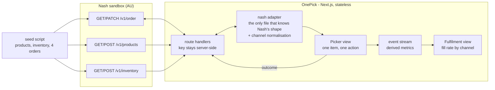

# OnePick - plan

Nash build day, 2026-08-06. Written 11:30, after the briefing call with Kareem.
Brief in `docs/BRIEF.md`. API research in `docs/API-NOTES.md`.

---

## The one-line pitch

**Three devices become one queue.** A FreshMart picker today carries an Uber device, a DoorDash device and a Coles first-party device. OnePick is one web app, on one device, that normalises all three and drives Nash's own pick-and-pack model.

---

## The single biggest finding

**Nash already models picking end to end.** `pick_and_pack` is a first-class capability, not something to invent.

```
order.requirements[] must include "pick_and_pack"

items[].subItems[]           <- the real pickable unit (a banana, a Coke)
  .substitution
      .preference            "substitute" | "refund"   <- the CUSTOMER already chose
      .source                who decided
      .substituteItems[]     { id, sku, quantity }     <- the approved alternatives

pickedItems[]
  .requestedQuantity         what was ordered
  .quantity                  what was actually picked
  .status                    picked | partially_picked | not_picked | substituted
  .weight                    kg, for WEIGHTED products
  .scannedBarcode            GS1 payload, carries weight and price
  .scans[]                   per-scan detail, .substitutionType

order status -> items_pick_complete
```

**The brief's four scenarios are Nash's four statuses.** R3 is not a design problem, it is a mapping problem.

| Brief says | Nash calls it |
|---|---|
| mark items picked | `picked` |
| partial quantities | `partially_picked` (`quantity` < `requestedQuantity`) |
| out of stock | `not_picked` |
| substitutions | `substituted`, driven by `subItems[].substitution` |

**So the app does not invent a domain. It drives Nash's.** That is the answer to Kareem's steer - *"can this be stateless, or can you utilise something in Nash?"*

> **Stateless. Nash holds the state.** No database, no session store. The picker's outcome is written to `pickedItems`, and `items_pick_complete` is the completion signal. If the tab closes, the run is recoverable from Nash.

---

## Answers from the briefing call

| Question | Kareem's answer |
|---|---|
| Sandbox seeded? | **No.** *"the account is actually not seeded… it's your choice of how you want to seed the data, how you create the storyline"* |
| Read endpoints? | **Yes.** `GET /v1/products`, `GET /v1/inventory?externalStoreLocationId=…` |
| Substitutions | Pre-authorised by the customer at checkout, like Uber Eats. Arrives in `subItems[].substitution` |
| Multi-channel | Coles web vs DoorDash app vs Uber app → **three physical devices in the store today** |
| Accuracy failure | *"I ordered a Diet Coke and they gave me a Coke"* - picker grabbing a lookalike at speed |
| Device | *"most of the time those are apps on chunky devices"* - build the lightweight web version |
| Scanning | In the real product. Available to use |
| Indoor GPS / nav | **Out.** Needs beacons. *"definitely not building this for the lightweight version"* |
| Route sequencing / cold chain | *"it's more operational… do you have to cover it? It really depends how much progress you have. It's up to you"* → **stretch only** |
| Ops manager view | *"not within scope, but it would be a plus"* |
| Analytics, NFRs | *"everything is a plus. The core is picking"* |
| Over-engineering | *"do I build a full-on net new product with net new infrastructure with a database? You don't have to do that"* |
| Deployment | Run locally. No deploy, no repo required |
| Check-in | **12:15**, then hourly. Zoom stays open, text in chat |

---

## Assumptions

| # | Assumption | If wrong |
|---|---|---|
| A1 | `subItems[]` is the pickable unit; `items[]` is the bag or tote | Re-map in the adapter, one file |
| A2 | Channel is not a first-class field - carry it on `tags` or the order `externalId` prefix | Normalise in the adapter either way. **The picker never sees it** |
| A3 | `PATCH /v1/order/{id}` writes `pickedItems`; order transitions to `items_pick_complete` | If a dedicated pick endpoint exists, swap one adapter function |
| A4 | One picker, one store, no auth | Hardcoded. Production note, never a demo problem |
| A5 | Sandbox volume is tiny - my own seed | No pagination. Say plainly that it is small |
| A6 | Aisle, bay and shelf are **strings** | `"A12"` will not sort numerically. Only matters if sequencing is reached |

---

## Out of scope - and this list is a deliverable

Kareem's rubric names *"ownership of what you built and what you skipped."* An unbuilt thing only scores if it is named.

| Not building | Why |
|---|---|
| **Dispatch and delivery** | Nash is dispatch. OnePick ends at `items_pick_complete` |
| **A database** | Kareem asked directly. Nash is the state. Stateless by design, not by shortcut |
| **Indoor navigation** | Needs beacons and store mapping. Kareem ruled it out explicitly |
| **Auth, roles, multi-tenancy** | Hardcode the picker. Production note |
| Route sequencing, cold chain | *"up to you"*, and it is not one of the four requirements. Stretch only |
| Batch picking - multiple orders per trip | Real, and the obvious next release. Not today |
| Customer notification on substitution | FreshMart's comms stack. Emit the event, do not own the channel |
| Offline queueing | Real in a supermarket. **Stated as an NFR, not built** |

---

## The demo storyline - seed data is the product pitch

The account is empty, which means **the data is mine to design**. Four orders, each seeded to demonstrate exactly one thing, arriving from three different channels.

**Store:** FreshMart Richmond, `externalId: freshmart-richmond`

| Order | Channel | Demonstrates |
|---|---|---|
| **A** | `web` (freshmart.com.au) | Clean pick. The happy path, end to end |
| **B** | `doordash` | **Partial quantity** - 1kg bananas, `WEIGHTED`, picker weighs 0.94kg |
| **C** | `uber` | **Substitution** - Diet Coke out of stock, customer pre-approved Coke Zero |
| **D** | `web` | **Not picked** - customer chose `preference: refund`, no substitute allowed |

**Order C uses Kareem's own accuracy example.** He said *"I ordered a Diet Coke and they gave me a Coke."* Seeding Diet Coke, Coke Zero and Coke as three lookalike SKUs on the same bay makes scan verification visibly necessary rather than theoretical.

~14 products, each with `location { aisle, bay, shelf }`. Two `WEIGHTED` - bananas and deli chicken.

---

## Architecture



**Why these boundaries.** The adapter is the only module that knows Nash's payload shape and it is where channel gets normalised - so the picker screen is channel-blind by construction, not by discipline. Route handlers keep the API key server-side and make CORS a non-event. There is **no store layer** because there is no state to store; Nash is the database.

---

## Operational metric

**Order fill rate** - units delivered ÷ units ordered.

One number that absorbs all four Nash statuses: `not_picked`, `partially_picked` and a declined `substituted` all reduce it. FreshMart already reports it, so it is recognised rather than invented.

Per stated pain, one metric each: **accuracy** → scan-verified pick rate · **speed** → units per hour · **substitutions** → substitution acceptance.

---

## Analytics and observability

- **Events:** `run_started` · `item_picked` · `item_partial` · `item_not_picked` · `item_substituted` · `scan_rejected` · `run_completed`
  Fields: `ts`, `runId`, `orderId`, `subItemId`, **`channel`**, `storeId`, `pickerId`, `sku`, `requestedQuantity`, `quantity`, `weightKg`, `durationMs`
- **Correlation id:** `runId` on every event, log line and response header
- **Read by whom, to decide what:** the FreshMart store manager, to decide **which channel is underperforming**. That is the answer to *"no unified view of fulfillment"*
- **Latency budget:** 200ms from scan to next item. Above that the picker scans twice, which is a data-quality bug not a UX bug

---

## Non-functional requirements

| NFR | Answer |
|---|---|
| **Failure mode** | Nash unreachable → picker keeps working the loaded run, outcomes queue, flush on completion. **Never block the picker on a network call** |
| **Connectivity** | Supermarket dead spots are real. Visible sync indicator. Full offline persistence stated, not built |
| **Scale** | Tiny by design - one store, four orders. Claiming scale I do not have is the over-engineering tell |
| **Security** | Key and org id server-side only. Never `NEXT_PUBLIC_` |
| **Data lifecycle** | Aisle and bay data goes stale on every store reset and nothing tells you. **Top production risk** |
| **Privacy** | Customer address on a device carried round a shop floor. Show the picker the minimum |
| **Physical context** | Handheld, one hand, trolley, gloves. 56px targets, 64px primary, high contrast, no hover |

---

## The clock - rebuilt from 11:30

| Time | Work | Gate |
|---|---|---|
| **11:30 - 12:10** | This plan. Seed data designed on paper - products, aisles, four orders, three channels | No app code |
| **12:10 - 12:15** | Send the plan to Kareem in chat before the call | |
| **12:15** | **Check-in.** Walk the plan, the storyline, and the pick-and-pack finding | |
| 12:25 - 12:55 | **Seed the sandbox.** Store location, products, inventory with locations, four orders | Data visible in the portal |
| 12:55 - 13:45 | **R1 + R2** - order queue with channel badges, pick screen: name, quantity, image, location | Walks an order start to finish |
| 13:45 - 14:20 | **R3** - all four outcomes, driven by Nash's statuses | Each of the four seeded orders behaves correctly |
| 14:20 - 14:40 | **R4** - write `pickedItems`, reach `items_pick_complete` | Status visible in the portal |
| **⛔ 14:40** | **HARD STOP - end to end runs.** If it does not, stop adding and finish it | |
| 14:40 - 15:05 | **The plus** - fulfilment view, fill rate by channel | Cut first if behind |
| **⛔ 15:05** | **FREEZE.** Broken things get cut, not fixed | |
| 15:05 - 15:30 | Deck for part 1, rehearse the click-through **once, out loud, timed**, reset the data | |
| **15:30 - 16:30** | **Present.** Part 1 customer 10-15 min · Part 2 technical 15-20 min | |

**Hourly check-ins with Kareem at 12:15, 13:15, 14:15, 15:15.** Two minutes each, never more.

**Cut order:** fulfilment view → scan verification → seeded order D. **Never cut R1-R4.**

---

## Part 2 structure - their headings, not mine

The brief names six sections. Use them verbatim.

1. **Working demo**
2. **Architecture and key decisions** - stateless, Nash as state, adapter owns the join and the channel normalisation
3. **Tradeoffs** - no database · no sequencing · pre-authorised substitutions only · seeded data
4. **Current state** - R1-R4 complete against the real API
5. **Future state** - batch picking, offline queue, sequencing by aisle, learned substitution ranking
6. **Next action items** - planogram feed, picker identity, webhook on `items_pick_complete`

---

## First failing test

`toPickedItems()` - the adapter function that turns picker outcomes into Nash's payload.

> Given a `subItem` with `requestedQuantity: 1` on a `WEIGHTED` product, when the picker records 0.94kg, the output has `status: "partially_picked"`, `quantity: 1`, `weight: 0.94` - **not** a binary picked flag and **not** a quantity of zero.

Chosen because weighted partials are the outcome most likely to be modelled wrongly, and because `toPickedItems()` is the one function every other feature depends on being right.
