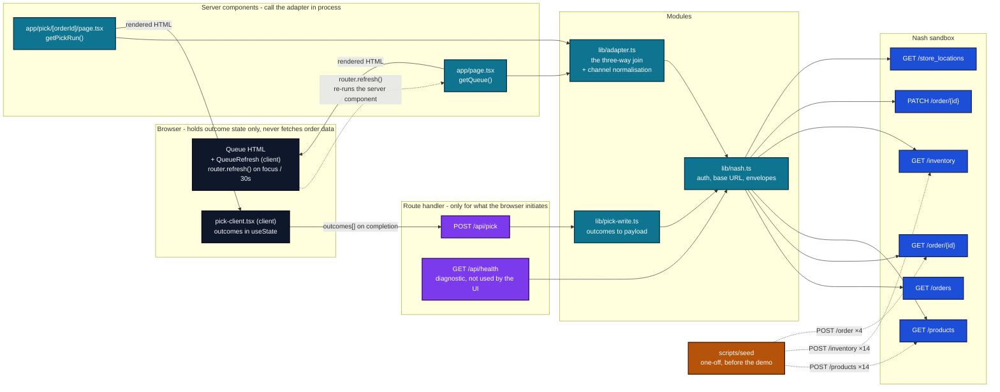
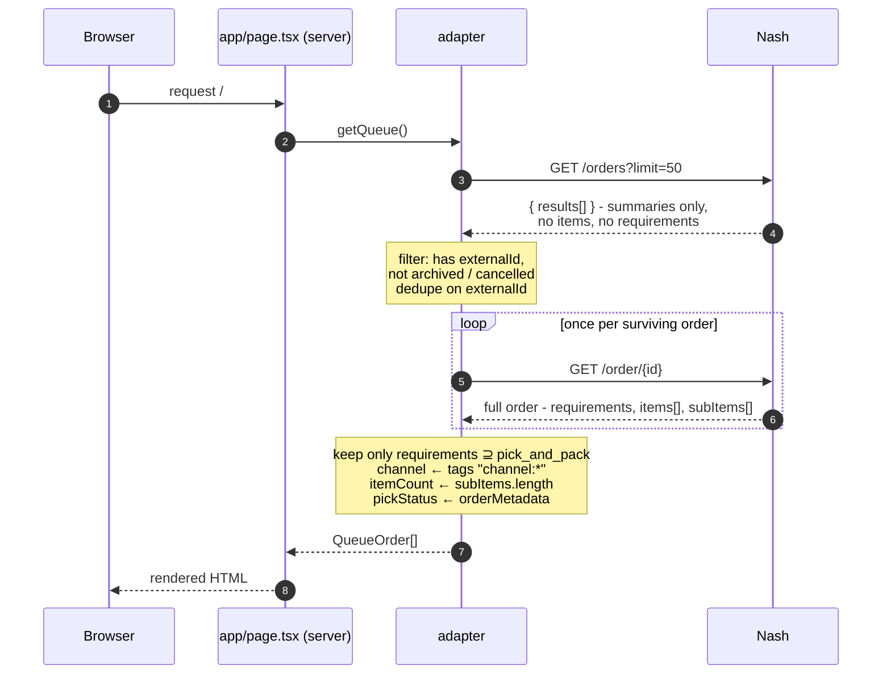
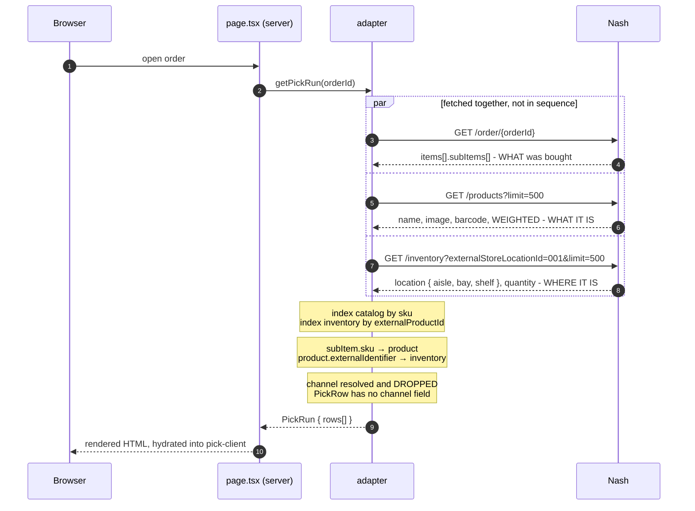
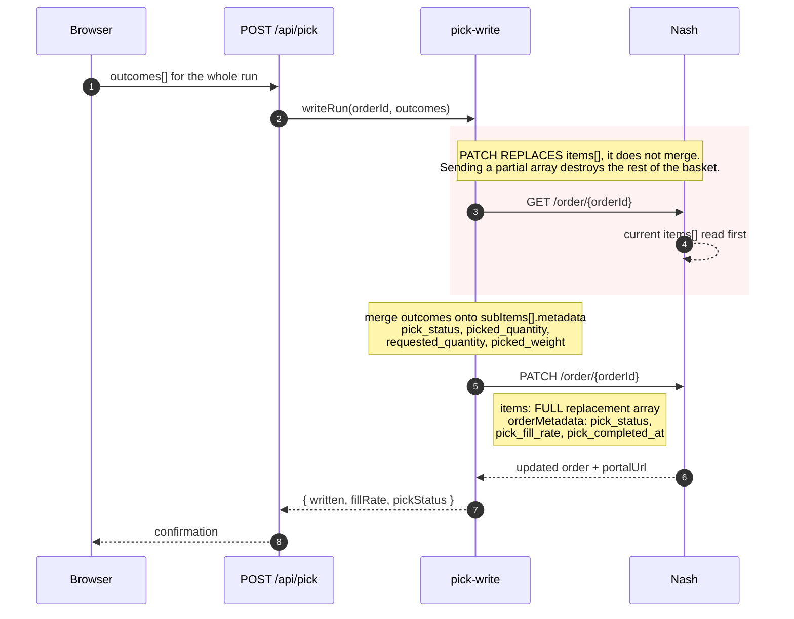

# API flow - every call, and why it exists

**There is no data fetching in the browser on the read path.** The queue and the pick screen are async server components - they call the adapter directly, in process, and the browser receives rendered HTML. No client fetch, no client-side order state, no HTTP hop.

```
READ    server component ──▶ adapter ──▶ Nash        (in process, no HTTP)
WRITE   client component ──▶ POST /api/pick ──▶ Nash (HTTP, because a tap starts it)
```

That asymmetry is the point. A route handler is only needed when the browser has to *initiate* something, and the only thing the browser initiates is the write at the end of a run. Reads never leave the server, so the key is not merely hidden from the bundle - it is never on a code path the browser can reach.

> **Note:** `GET /api/orders`, `GET /api/orders/[orderId]` and `GET /api/health` exist and work, but nothing in the app calls them. The first two are genuinely unused - server components made them redundant. `/api/health` is a deliberate diagnostic, meant for `curl` and not for the UI.

---

## The whole picture



---

## Flow 1 - the queue

`app/page.tsx` is an **async server component**. There is no `fetch` in the browser and no client-side queue.



**Why the second call exists.** `GET /orders` is a summary endpoint - it returns no `items` and no `requirements`. Item count and the pick-and-pack filter both need the detail, so the queue costs `1 + N` calls.

**At four orders that is five calls.** It is the first thing that changes at real volume, and the fix is a list endpoint that returns `requirements` and an item count.

### It refreshes, and the refresh is not an API call

`QueueRefresh` is a client component that holds no data. It calls `router.refresh()`, which re-runs the **server component** - so the adapter re-joins against Nash and new HTML is streamed in. Nothing polls `/api/orders`, because nothing calls `/api/orders`.

| Trigger | Why |
|---|---|
| `focus` and `visibilitychange` | The picker pockets the device, walks an aisle, pulls it out. That is when the queue is most likely to be stale, and catching it is free |
| 30-second interval | Backstop for a device left awake on a bench |

**The cost, which is worth naming before someone works it out:** each refresh is a full `1 + N`. With four orders that is **five Nash calls every thirty seconds per open device**, whether or not anything changed. At one store on a demo it is nothing. At fifty stores with idle devices on chargers it is real load for no information.

The right answer at scale is a **webhook on order updates** rather than a timer - push instead of poll. That is named as a next action rather than pretended at here.

---

## Flow 2 - the pick run, and the three-way join

`app/pick/[orderId]/page.tsx`, also a server component → `getPickRun()`

**This is the core of the app.** Three resources are needed to render one pick row, and they are fetched in parallel.



**The join is two hops, not one.**

```
subItem.sku ──▶ product ──▶ product.externalIdentifier ──▶ inventory ──▶ location
```

Inventory keys on the product's *external* id, not its Nash id. That mismatch is the kind of thing that returns `200` with an empty result rather than an error, so a join miss is logged rather than swallowed - an empty aisle column reads as missing data, not as a bug.

**The catalog is fetched whole and indexed, not looked up per item.** Per-item lookup would turn one order into a dozen calls. Correct at 14 products, wrong at 40,000 - at which point `GET /products` takes a SKU filter and this is a one-function change.

---

## Flow 3 - writing the outcome back

`POST /api/pick` → `writeRun()`



**Two things here are consequences of what the API actually does, not preferences.**

`pickedItems` does not exist - `updateOrder` rejects it - and order `status` is not writable. So outcomes land on `subItems[].metadata` and the run summary on `orderMetadata`. Completion is `pick_status: items_pick_complete`, which is **this app's convention, not a Nash state**. Dispatch will not trigger off it.

**One PATCH per run, not one per tap.** Because PATCH replaces `items`, a per-tap write would need a read-modify-write cycle every time, and two overlapping taps would lose an outcome. Batching makes the write atomic for the run. The cost: an outcome is not durable until the run completes.

---

## Flow 4 - health

`GET /api/health` proves auth and shows live counts, so "is the data really there" is answerable without opening the portal.

```
GET /store_locations · GET /products · GET /inventory · GET /orders   (parallel)
```

---

## Every endpoint, in one table

| Endpoint | Called by | Per what | Why |
|---|---|---|---|
| `GET /orders?limit=50` | `getQueue` | once per queue load **and per 30s refresh** | The order list. Summaries only |
| `GET /order/{id}` | `getQueue` | **once per order**, same cadence | Summaries carry no `requirements` or `items` |
| `GET /order/{id}` | `getPickRun` | once per pick run | What was bought |
| `GET /products?limit=500` | `getPickRun` | once per pick run | Name, image, barcode, `WEIGHTED` |
| `GET /inventory?externalStoreLocationId` | `getPickRun` | once per pick run | **`location { aisle, bay, shelf }`** and stock |
| `GET /order/{id}` | `writeRun` | once per completion | Must read before PATCH replaces |
| `PATCH /order/{id}` | `writeRun` | **once per run** | Outcomes + run summary |
| `GET /store_locations` | health | on demand | Auth check |
| `POST /products` | seed | ×14, one-off | Catalog |
| `POST /inventory` | seed | ×14, one-off | Per-store location and stock |
| `POST /order` | seed | ×4, one-off | The demo storyline |

**A full run of one four-item order: 5 for the queue, 3 for the pick screen, 2 to write. Ten calls.**

---

## What the API would not let us do

Worth knowing, because it shaped the flows above.

| Wanted | Actual |
|---|---|
| `PATCH { pickedItems }` | `400 Unknown argument 'pickedItems' on field 'NashMutations.updateOrder'` |
| `PATCH { status: "items_pick_complete" }` | `400` - `status` is not an argument on update |
| `PATCH` a single sub-item's `status` or `substitution` | **`200`, silently dropped.** Only `metadata` persists |
| `PATCH` a partial `items` array | Succeeds, and **wipes** every field not sent |
| One list call with items | `GET /orders` is summary-only, hence `1 + N` |

The third row is the dangerous one: a write that reports success and persists nothing looks like a working feature until someone checks the portal.
