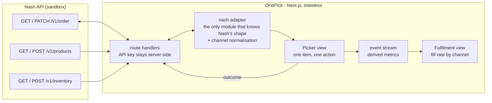

# OnePick - architecture

A lightweight web picking app for FreshMart, built on Nash's pick-and-pack model.

**The problem:** a picker in a FreshMart store today carries three devices - one for Uber orders, one for DoorDash, one for the first-party site. Three queues, three interfaces, no single view of what the store owes anyone.

**What this is:** one web app, one queue, one device.

---

## 1. The shape



Three modules, one rule each:

| Module | Rule |
|---|---|
| **Route handlers** | The only place the API key exists. Nothing browser-side ever holds a credential, and CORS never becomes a problem |
| **Adapter** | The only module that knows Nash's payload shape. Channel normalisation happens here, so the picker view is channel-blind **by construction**, not by discipline |
| **Views** | Picker and fulfilment. Both read the same data; neither writes to Nash directly |

---

## 2. Key decisions

### 2.1 Stateless. Nash holds the state.

There is no database and no session store. Picking outcomes are written to Nash's `pickedItems`, and the order's transition to `items_pick_complete` is the completion signal.

**Why:** the state already has an owner. A local store would be a second copy of the truth, and the failure mode of two copies is that they disagree - silently, and usually during a demo. Close the tab mid-run and the run is recoverable, because it was never held here.

**What it costs:** every outcome is a network round trip, so the UI has to stay responsive while writes are in flight.

### 2.2 Drive Nash's domain model, do not invent one

Nash models picking end to end. The exercise's four scenarios map exactly onto statuses that already exist:

| Scenario | Nash |
|---|---|
| Mark picked | `picked` |
| Partial quantity | `partially_picked` - `quantity` < `requestedQuantity` |
| Out of stock | `not_picked` |
| Substitution | `substituted`, driven by `subItems[].substitution` |

```
order.requirements[] includes "pick_and_pack"

items[].subItems[]                      the pickable unit
  .substitution
      .preference     "substitute" | "refund"
      .substituteItems[]  { id, sku, quantity }

pickedItems[]
  .requestedQuantity  .quantity  .status  .weight  .scannedBarcode  .scans[]
```

**Consequence:** substitutions are **pre-authorised by the customer at checkout**, the same pattern as Uber Eats. The picker is not choosing a replacement - they are applying a decision already made, which is why the substitution flow is one tap rather than a search.

### 2.3 The three-way join lives in the adapter

An order knows *what* was bought. The catalog knows *what it is*. Per-store inventory knows *where it is* - `location { aisle, bay, shelf }` is on inventory, not on the order.

```
order.items[].subItems[]  --sku-->  products  --productId + storeLocationId-->  inventory
```

Rendering one row of a pick list needs all three. The join is the highest-risk piece of integration work, so it is built first, against real payloads rather than against types written in advance.

### 2.4 Weighted items are a first-class case

Products carry an `attributes: ["WEIGHTED"]` flag and `details.weightedItemInfo`. Deli, produce and meat are sold by weight: a customer orders 1kg of bananas and the picker weighs 0.94kg.

That is `partially_picked` with a `weight`, and it is **why partial quantity exists as a requirement at all**. A boolean `picked` flag anywhere in the domain makes it unrepresentable, so there isn't one.

### 2.5 Designed for a handheld

Real stores run this on rugged handhelds. This is the lightweight web equivalent, so it is designed for that form factor rather than shrunk from a desktop layout: 360px-wide layout, 56px minimum touch targets and 64px for the primary action, high contrast for freezer-aisle-to-loading-dock lighting, and no hover states because there is no mouse.

---

## 3. Analytics and observability

**Analytics** answers *"how did the shift go"*. **Observability** answers *"what happened to this one order"*. Different consumers, different designs, one stream.

- **Events:** `run_started` · `item_picked` · `item_partial` · `item_not_picked` · `item_substituted` · `scan_rejected` · `run_completed`
- **Dimensions:** `ts`, `runId`, `orderId`, `subItemId`, **`channel`**, `storeId`, `pickerId`, `sku`, `requestedQuantity`, `quantity`, `weightKg`, `durationMs`
- **Correlation id:** `runId` on every event, every log line and every response header
- **Latency budget:** 200ms from scan to next item. Above that a picker scans twice, and a double scan is a data-quality problem, not a UX one

**Headline metric: order fill rate** - units delivered over units ordered. One number that absorbs every unhappy outcome, and one retailers already report against.

**The cut that matters is by channel.** Web orders filling at 96% while marketplace orders fill at 89% is invisible when the channels live on separate devices. That comparison is the point of unifying them.

---

## 4. Non-functional requirements

| | |
|---|---|
| **Failure mode** | Nash unreachable → the picker keeps working the loaded run, outcomes queue, flush on completion. **Never block the picker on a network call** |
| **Connectivity** | Supermarket wifi has dead spots. Sync state is visible to the picker. Durable offline persistence is named below as future work, not claimed here |
| **Scale** | Small and deliberately so - one store, a handful of orders |
| **Security** | API key and org id are server-side only, never `NEXT_PUBLIC_` |
| **Data lifecycle** | Aisle and bay data goes stale every time a store resets a bay, and nothing signals it. The top production risk |
| **Privacy** | Customer details on a device carried around a shop floor. The picker screen shows the minimum needed to pick |

---

## 5. Tradeoffs

| Chose | Over | Because |
|---|---|---|
| Stateless, Nash as the store | A local database | Two copies of the truth eventually disagree. Costs a round trip per outcome |
| Nash's `pickedItems` model | A bespoke picking domain | The platform already models this. A parallel model would need reconciling forever |
| Seeded demo catalog | Production-shaped data pipeline | The account starts empty. Seeding is the fastest path to a real end-to-end flow |
| One order at a time | Batch picking | Batching multiplies tote-assignment complexity and demonstrates nothing the single flow does not |
| Displaying location | Optimising the route | Sequencing is a genuine efficiency lever, but it is not one of the requirements |
| Hardcoded picker | Auth and roles | No requirement depends on identity today |

---

## 6. Current state

- Orders fetched from Nash's sandbox, normalised across three channels into one queue
- Picker walked through each sub-item: name, quantity, image, aisle / bay / shelf
- All four outcomes recorded against Nash's own statuses
- Completion written back, order reaching `items_pick_complete`

---

## 7. Future state

| | |
|---|---|
| **Batch picking** | Several orders per trip with tote assignment. The single largest throughput lever |
| **Offline durability** | Service worker plus IndexedDB, so a dead spot never costs a pick |
| **Pick sequencing** | Serpentine ordering by aisle and bay. Cheap now that location data exists, though aisle values are strings and need a collation strategy |
| **Learned substitution ranking** | The same event stream becomes training data for which substitutions customers actually accept |
| **Picker identity** | Per-store accounts, which turns accuracy into a coachable per-person metric |

---

## 8. Next action items

1. A planogram feed - location data is only as good as its freshness, and today nothing tells you when a bay moves
2. Webhook subscription on `items_pick_complete` rather than polling order status
3. Picker identity tied to the store's existing device management
4. Confirm the substitution `source` semantics - who is recorded as having authorised a substitute, and what the audit expectation is

---

## Running it

```bash
cp .env.example .env           # fill in the sandbox key and store location
npm install
npm run dev
```

Nash sandbox: `https://api.sandbox.usenash.com/v1`
