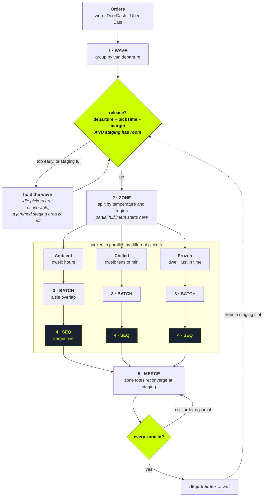

# Batching and partial order fulfilment

The next algorithm. Designed, measured, deliberately not built.

> Kareem, in the mid-build call: *at grocery density you do not pick order by
> order. Ten orders due at 2pm, you pick a third of all ten at a time.* And
> then, twice: **do not build this today.**

This is the design. It exists because "batching would help" is a slogan, and
a slogan is what you say when you have not worked out what breaks.

---

## 1. The constraint is not routing

The obvious framing is travelling-salesman across several orders. That framing
is wrong, and the thing that makes it wrong is one sentence from the call:

> *The picker sets them on a shelf, a staging area. Once that staging area is
> full, no one can pick any more.*

Staging is a **work-in-progress limit**. It converts a distance problem into a
flow problem, and flow problems have a different governing equation:

```
throughput  =  staging slots / average dwell time
```

Dwell is the time from a tote being staged to the van taking it. So there are
only two ways to lift throughput: build more staging, or **stage things later**.

That inverts the intuition. The safe-feeling heuristic is to pick early, get
ahead, build a buffer. Under a WIP limit, picking early is the thing that jams
the floor. The right release time is the **latest** one that still makes the
van.

This is also why the answer is not "batch everything in the morning". It is
why the staging area exists as a constraint at all.

---

## 2. What we are actually optimising

Maximise orders dispatched per shift, subject to:

| | Constraint | Type |
|---|---|---|
| C1 | Every order fully staged before its van departs | hard |
| C2 | Staged totes ≤ staging capacity, at every instant | hard |
| C3 | Frozen dwell in tote ≤ threshold | hard, quality |
| C4 | Picker labour seconds | minimise - this is the money |

Two coupled decisions fall out, and most treatments only answer the first:

- **(a) What to pick together** - batch composition. Spatial.
- **(b) When to release it** - scheduling. Temporal, driven by C2.

(b) is the one the staging constraint hands you, and it is the one that is
missing from every "multi-order picking" tutorial.

Solving (a) and (b) jointly is NP-hard: it is order batching plus picker
routing plus scheduling, all coupled. So do not solve it jointly. Decompose it,
and be explicit that the decomposition is the engineering decision.

---

## 3. The algorithm, in five stages



The two things to read off that picture:

**The dotted edge is the whole design.** A van leaving frees a staging slot,
which is what permits the next wave to release. Throughput is governed by that
loop, not by how fast anyone walks.

**The parallel block is partial order fulfilment.** One order is picked by
three people at once and is not a whole order again until merge. Highlighted in
green is what is already shipped: sequencing does not change.

### Stage 1 - Wave formation (temporal)

A wave is every order sharing a van departure.

```
release(wave) = departure - estimatedPickDuration(wave) - safetyMargin
```

Hold the wave until `release`, and until staging has room for what it will
produce. A wave that cannot be staged is not released, however idle the
pickers look. Idle pickers are recoverable; a jammed staging area stops the
whole store.

### Stage 2 - Zone partition (spatial, and the parallel axis)

Split the store by temperature class and region:

| Zone | Aisles | Dwell budget |
|---|---|---|
| Ambient | Produce, Bakery, Deli, 1-5 | hours |
| Chilled | Chilled | tens of minutes |
| Frozen | Frozen | minutes |

Each zone is picked independently, by different pickers, at the same time.

**This is where partial order fulfilment begins.** An order is no longer picked
by one person in one pass. It is picked in pieces, by zone, and only becomes a
whole order again at staging.

The consequence that matters for scheduling: **the slowest zone sets the
order's completion time.** If Ambient has 40 lines and Chilled has 3, Ambient
is the critical path and balancing labour across zones matters more than
shaving metres off any one route.

### Stage 3 - Batch formation within a zone

Group orders onto one trolley. Capacity is the smaller of the physical trolley
and the staging slots that will be free when the batch lands:

```
capacity = min(trolleyTotes, stagingSlotsAvailableAt(completionEstimate))
```

Composition is a set-partitioning problem, so use a **seed-and-extend greedy on
aisle overlap**:

```
seed    = the order touching the most aisles
          (it already pays for the longest walk)
extend  = repeatedly add the order that adds the FEWEST NEW aisles
until   = capacity reached
```

The whole idea in one line: **a batch is worth forming when its orders overlap
in space.** Grouping by arrival time, or by customer, or at random, does the
same amount of work for a much worse answer.

Greedy rather than optimal, on purpose. The marginal gain of an exact solver
over greedy-on-overlap is smaller than the variance introduced by a picker
stopping to answer a question. Optimality here is a rounding error on a noisy
floor.

*Implemented and measured in `scripts/analysis/batching.ts`.*

### Stage 4 - Sequence within the batch

**Unchanged.** The union of the batch's lines is just a larger basket, and
`sequence()` already serpentines any basket over `STORE_LAYOUT`.

That is the useful property of having built the cost function first: batching
is a new *input* to the shipped algorithm, not a replacement for it.

### Stage 5 - Merge at staging

Zone totes for one order converge. The order becomes dispatchable only when
every zone reports in.

This needs a state that does not exist today: **per-zone completion on the
order**, not just per-item status. It is the single largest data model change
in the whole design.

---

## 4. Cold chain inverts, and the shipped rule turns out to be a special case

Today `sequence()` walks frozen last. The reason is dwell: a tub of ice cream
picked first sits in the tote for the length of the run.

Under waves, a run can last forty minutes, and "last in the sequence" stops
being good enough. Frozen has to become **its own zone, released just in time
against the van clock**, rather than a position in a sort.

Which reframes what is already shipped:

> Frozen-last is the **N=1 degenerate case** of a dwell budget per temperature
> class. With one order and one picker, the dwell budget collapses to "go
> last". The general rule was always the dwell budget. The current code is what
> it looks like when the wave has one order in it.

The existing algorithm does not get thrown away. It gets a parameter.

---

## 5. Accuracy under batching, and why the scan gate already fits

Today the scan gate proves you have the **right item**.

Batching adds a second question: the **right tote**. Put-to-wrong-tote is a new
error class, and it is a *double* error - order A receives B's item and is
simultaneously short its own. One mis-sort damages two customers.

Mitigation is a second gate, not a redesign:

```
scan item   -> proves WHAT is in your hand   (shipped)
scan tote   -> proves WHERE it is going      (the batching addition)
```

The state machine already shipped (`waiting -> verified | wrong | overridden`)
extends to a second gate unchanged. Same override path, same audit trail, same
`scan_override` written to Nash.

This is the strongest argument that the scan work was not a stretch goal.
Batching is the thing that makes scanning **load-bearing** rather than merely
good practice: without it, batching trades speed for accuracy, and grocery will
not take that trade.

---

## 6. What breaks

Named, because a design that lists only benefits has not been thought about.

| Risk | Why it bites | Mitigation |
|---|---|---|
| **Blast radius** | Abandoning a batch strands N orders, not 1 | Cap batch size by SLA risk, not just trolley size |
| **Substitution storms** | One out-of-stock line hits every order in the batch at once | Pre-authorised substitution policy. Live per-customer contact does not scale to a wave |
| **Staging deadlock** | Release that ignores slot availability jams the floor | C2 is a hard gate on release, never a warning |
| **Zone imbalance** | The slowest zone holds every order in the wave | Balance labour by zone line-count, re-check per wave |
| **Mis-sort** | Double error, two customers affected | Tote scan (section 5) |
| **Re-optimisation churn** | Recomputing mid-pick moves the ground under the picker | Freeze batch composition at release. Re-optimise the next wave, never the running one |

---

## 7. Measured, not asserted

`scripts/analysis/batching.ts`, run against the four orders actually seeded in
the sandbox, using the same `travel()` and `sequence()` the pick screen uses:

```
Order by order, sequenced     160 s walking
One wave, sequenced once       72 s walking
Put-to-tote, 13 lines         +52 s sortation
Wave, all in                  124 s

NET  -36 s across 4 orders  (23%)
Per line: 12.3 s -> 9.5 s
```

Two things about that number are deliberate.

**The sortation cost is inside it.** A batching figure that counts only the
walking saved is the figure a vendor quotes. Put-to-tote is paid on *every*
line, including the ones that saved nothing, and it is the term that decides
whether a batch is worth forming at all.

**n = 4.** Four orders is a demonstration of method, not a study. The saving
grows with wave size and with aisle overlap, so this understates it - but the
honest claim is the mechanism and the direction, not a percentage to quote at
Coles.

---

## 8. When does a store need this?

The tiers map to how Nash takes a product to market:

| Tier | Customer | Algorithm | Status |
|---|---|---|---|
| **1** | Design partner, single store | One order, serpentine, scan gate | **Shipped today** |
| **2** | Mid-market, ~50 stores (FreshMart) | Wave formation, zone split, partial fulfilment, merge at staging | Designed above |
| **3** | Coles / Woolworths | Full batch optimisation, staging as WIP constraint, live labour balancing | The month's project |

Order-by-order is not a naive version of tier 2. At tier 1 density it is
**correct**: too few concurrent orders overlap, so sortation cost exceeds
walking saved and batching makes the store slower.

Which gives a real answer to "when do we upgrade this store?" rather than a
sales one:

> Run the cost function over that store's own order book. Batching pays from
> the point where saved walking exceeds sortation cost. That crossover is a
> property of the store's layout and order density, and it is **measurable per
> store, before selling anyone anything.**

That threshold is what `scripts/analysis/batching.ts` computes.
