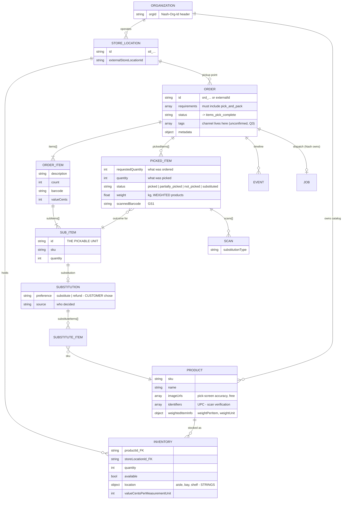

# Nash entity model

What Nash's own objects are and how they hang together, from https://docs.usenash.com/.
Research in `_context/API-NOTES.md`. **OnePick invents no entities** - it drives these.

---

## The diagram



---

## The one thing to remember

**Three resources render one row of the pick list.**

| Resource | Answers |
|---|---|
| **Order** | *what was bought* |
| **Product** | *what it is* - name, image, barcode |
| **Inventory** | *where it is in this store* - aisle, bay, shelf |

`location` lives on **inventory**, not on the order. So the pick screen cannot be built from one call, and the adapter owns that three-way join. It is the first thing built and the most likely place to lose an hour.

```
order.items[].subItems[]
   |  join on barcode / sku
   v
product  (org-wide catalog)
   |  join on productId + storeLocationId
   v
inventory.location { aisle, bay, shelf }
```

---

## `items[]` vs `subItems[]`

`items[]` is the **bag or tote** - the delivery-side unit Nash dispatches.
`subItems[]` is the **banana or the Coke** - the thing a picker actually walks to and grabs.

**Pick against `subItems[]`.** Assumption A1 in `_context/plan.md`; if wrong, it is one file in the adapter.

---

## Where the four brief scenarios live

R3's four scenarios are not a design problem, they are a **mapping** problem - Nash already has all four.

| Brief says | Nash field |
|---|---|
| mark items picked | `pickedItems[].status = picked` |
| partial quantities | `partially_picked`, `quantity` < `requestedQuantity` (+ `weight`) |
| out of stock | `not_picked` |
| substitutions | `substituted`, driven by `subItems[].substitution` |

**Substitution is decided upstream.** The customer pre-authorises at checkout - `preference: "substitute" | "refund"` with an approved `substituteItems[]` list. The picker chooses from that list; they never invent one. That is why substitution is a *selection* UI, not a *search* UI.

**Partial is a quantity, not a status.** `weightedItemInfo` exists because deli and produce sell by weight - 1kg ordered, 0.94kg on the scale. Any `picked: boolean` anywhere in the domain makes that unrepresentable.

---

## What is NOT an entity

| | |
|---|---|
| **Channel** | No field on the order. Derived in the adapter from `tags` / `metadata` / `externalId` prefix. **Q3 is still open.** The absence is the pitch: Nash has no opinion about channel, which is exactly why FreshMart's channels ended up on three systems |
| **A pick session / run** | Nash has no picking endpoint. Picking state is transient and local; Nash receives the **outcome** (`pickedItems`), never the keystrokes. No database |
| **Picker** | Not modelled. Hardcoded, production note |

---

## The boundary

```
Customer -> Order -> [ PICKING ] -> items_pick_complete | Job -> Route -> Delivery
                     ^^^^^^^^^^^                          ^^^^^^^^^^^^^^^^^^^^^^^^
                     OnePick                              Nash already does this
```

OnePick ends at `items_pick_complete`. Everything right of that line - Jobs, Routes, Dispatch Strategies, Zones, Delivery Windows - is Nash's, and building any of it is the over-engineering trap.

Nash's **Event Timeline** already keeps a per-order history. OnePick's events are the picking half of that same story.
