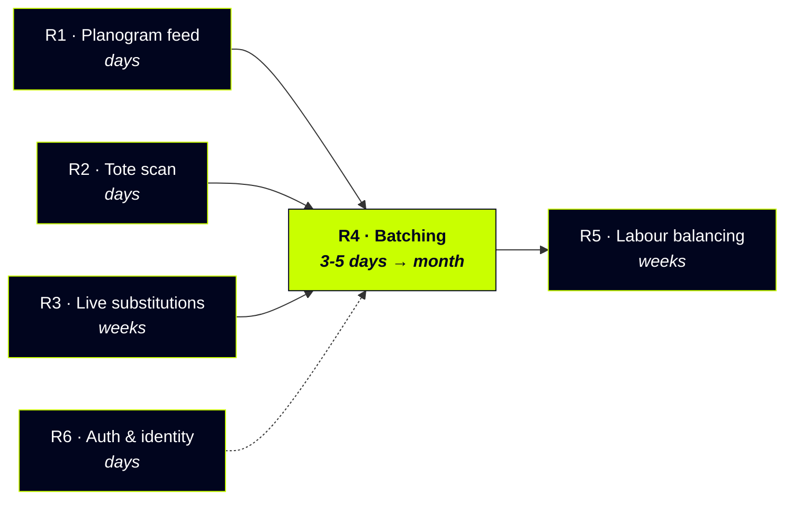

# Roadmap

What is shipped, what comes next, and what it costs. Ordered by the value it
unlocks rather than by how interesting it is to build.

---

## Shipped

| | Capability |
|---|---|
| ✅ | Unified queue across channels - web, DoorDash, Uber Eats, one list, channel-blind to the picker |
| ✅ | Serpentine route sequencing over a per-store layout, cold chain aware |
| ✅ | Four pick outcomes - picked, partially picked, not picked, substituted |
| ✅ | Weighed goods, so a 0.94kg pick against a 1kg order is recorded honestly |
| ✅ | Barcode scan verification, with a named override path and an audit trail |
| ✅ | Pre-approved substitutions, scanned against the substitute rather than the original |
| ✅ | Write-back to Nash on `subItems[].metadata`, run summary on `orderMetadata` |
| ✅ | Completed runs reopen read-only, because `PATCH` replaces rather than merges |
| ✅ | Operations report - fill rate by channel, override rate, walking saved per shift |

---

## Next

### R1 - Planogram feed
**Days. Highest value per hour of the lot.**

Sequencing on stale location data is the one failure that is worse than no
sequencing, because the picker trusts it and walks confidently to the wrong
bay. Today `STORE_LAYOUT` is a constant and nothing detects a bay moving.

An unknown aisle already sorts to the end of the run rather than being
guessed at, which is the safe behaviour. This makes it unnecessary.

### R2 - Tote scan
**Days. Prerequisite for R4.**

Extends the shipped scan gate with a second question: right item, right tote.
Not needed while one run is one order. Mandatory the moment a picker carries
more than one.

### R3 - Live substitution decisions
**Weeks.**

Today substitutions are pre-approved at checkout. Real stores need the picker
to propose one and the customer to accept it while the run is still open,
which means push to the customer and a timeout policy for when they do not
answer.

Note the ordering dependency: under batching this stops being feasible per
customer, so the policy engine has to exist **before** R4, not after.

### R4 - Batching and partial order fulfilment
**Tier 2: 3-5 days. Tier 3: the month.**

Full design in [BATCHING.md](./BATCHING.md).

The short version: at grocery density you do not pick order by order. Orders
sharing a van departure form a wave, the wave splits by zone, and each zone is
picked as one batch across many orders. An order is then only whole again at
staging.

Measured on the four seeded orders: **23% less walking, 2.8 seconds per line,
with put-to-tote sortation already deducted.**

A useful first slice is a **read-only planning view** - form the batch, sequence
the union, assign totes, show the numbers. About an hour, and it touches
nothing that already works.

### R5 - Labour balancing across zones
**Weeks. Only after R4.**

Once zones are picked in parallel, the slowest zone sets every order's
completion time in the wave. Balancing pickers across zones by line count is
worth more at that point than any further routing gain.

### R6 - Authentication and picker identity
**Days.**

Deliberately out of scope for this build. Needed before any real deployment:
who picked this run, who took that override, and preventing two pickers from
claiming the same order.

---

## Deliberately not doing

| | Why |
|---|---|
| **Travelling-salesman routing** | A supermarket is parallel aisles walked in order. Serpentine over a known layout captures nearly all the gain with none of the fragility |
| **Optimal batch formation** | Set partitioning is NP-hard and the gain over greedy-on-overlap is smaller than the variance from a picker answering a question |
| **Real-time WebSockets** | ~10 concurrent pickers per store. Polling is correct at that scale, and cheaper to operate |
| **In-store maps or turn-by-turn** | No indoor positioning. A sequenced list against aisle and bay is what the store already has and already trusts |
| **Images on the pick screen** | Slows a handheld on store wifi. Name, size and location identify the item; the scan proves it |

---

## Sequencing the roadmap

R1, R2 and R3 are not optional preludes to batching. Each one is a thing that
breaks *because of* batching:

- **R1** - a wave walks further, so stale locations cost more
- **R2** - put-to-wrong-tote is a new error class that does not exist today
- **R3** - one out-of-stock line hits every order in the batch at once, and
  live per-customer contact does not scale to a wave

Which is the real argument for the ordering: batching is not blocked by
effort, it is blocked by the accuracy work that has to land first.
