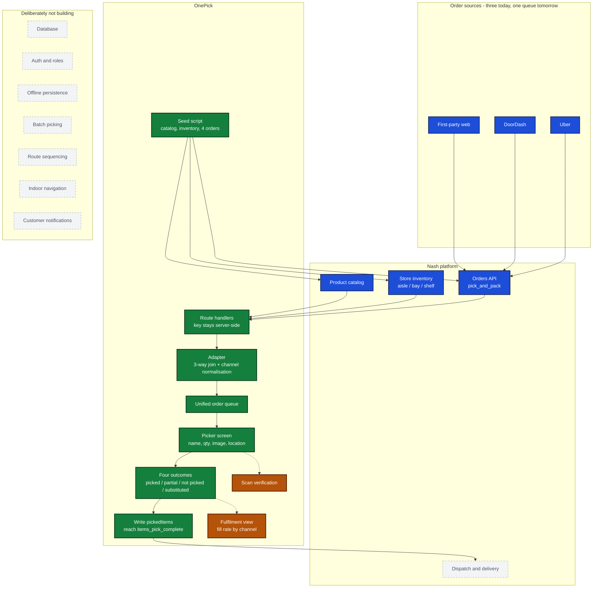

# OnePick - scope

What is being built, what is deliberately not, and where the boundary with Nash sits.

**Read this before the architecture doc.** Ownership of what was skipped matters as much as what was shipped.

---

## Legend

| | Meaning |
|---|---|
| 🟩 **Committed** | In scope today. The contract - these are what "done" means |
| 🟨 **Stretch** | Built only if the core is finished and stable. First to be cut |
| ⬜ **Not building** | Deliberately excluded. Each one has a reason, not an excuse |
| 🟦 **Nash** | Already exists in the platform. Used, not rebuilt |

---

## The picture



---

## 🟩 Committed - the four requirements are the contract

Committed means in scope, not finished. What is actually working is tracked in
`ARCHITECTURE.md` section 6, and nothing is claimed there until it has run live.

| | Requirement | What it means concretely |
|---|---|---|
| **R1** | Fetch orders from Nash's sandbox | Real API, real payloads. Channels normalised into **one queue**. Channel is seeded demo metadata, not a Nash field |
| **R2** | Guide the picker through items | Name, quantity, image, and `aisle / bay / shelf` from per-store inventory |
| **R3** | Handle the picking scenarios | All four, mapped onto Nash's own statuses rather than invented |
| **R4** | Update Nash when picking is complete | `pickedItems` written back, order reaches `items_pick_complete`. **Write path unverified - confirm before building** |

Plus the seed script, because the sandbox account starts empty and **the seed data is the demo storyline**.

---

## 🟨 Stretch - built only if the core is stable

| | Why it is worth doing | Why it is not core |
|---|---|---|
| **Scan verification** | Directly answers the accuracy pain - *"I ordered a Diet Coke and they gave me a Coke"*. Barcodes are already on the order item and the product | The four requirements do not mention it |
| **Fulfilment view** | Answers *"no unified view of fulfillment"*. Fill rate cut **by channel** is the number nobody at FreshMart can see today | Confirmed as *"a plus"*, not scope |

**Cut order if behind: fulfilment view first, then scan verification.**

---

## ⬜ Not building - each with its reason

| | Why not | What would change my mind |
|---|---|---|
| **Database** | Nash already owns this state. A second copy is a second truth, and two truths eventually disagree | Multi-device handoff mid-run, or offline durability |
| **Auth and roles** | No requirement today depends on identity | The moment accuracy becomes a per-picker coaching metric |
| **Offline persistence** | Genuinely real in a supermarket. Service worker plus IndexedDB is half a day on its own | Any pilot in a store with known dead spots |
| **Batch picking** | Several orders per trip. The largest throughput lever available, and the obvious next release | It is release two, not today |
| **Route sequencing** | Location data exists, so this is cheap later. But `location` is *displayed* in the brief, not *computed* | Once throughput rather than accuracy is the binding constraint |
| **Indoor navigation** | Needs beacons and a mapped store. Ruled out on the briefing call | Not in a lightweight web app, ever |
| **Customer notifications** | Substitution comms belong to FreshMart's own stack. OnePick emits the event; it should not own the channel | Never - this is a boundary, not a backlog item |
| **Dispatch and delivery** | **This is Nash.** OnePick ends at `items_pick_complete` | Never |

---

## The boundary, in one line

```
order arrives ──▶ [ OnePick: pick it ] ──▶ items_pick_complete ──▶ [ Nash: deliver it ]
```

---

## Working agreement

**Micro-commits.** One commit per working increment, each independently revertible, message stating what changed and why. The git history is part of the technical review - it should read as a sequence of decisions, not a single dump.

**Rationale is tracked as it happens**, in `DECISIONS.md`. A decision recorded three hours later is a reconstruction, not a record.
