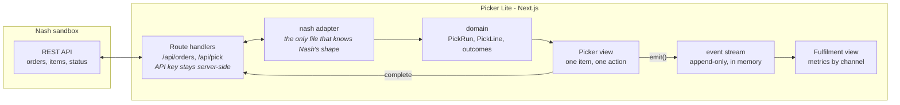

# Picker Lite

Nash AI build day, 2026-08-06. Brief dissected in `docs/BRIEF.md`.

---

## Understanding

FreshMart's pickers work orders that arrive from several channels on several systems, so they juggle screens and nobody can see fulfilment end to end. Build **one web app** that pulls orders from Nash, walks a picker through each item, handles the four real-world outcomes at the shelf, and reports completion back to Nash.

The product claim in one line: **one queue, many sources.** The picker never learns which channel an order came from, and the manager finally sees all of them in one place.

---

## Assumptions I'm making

Each one, and what changes if it is wrong.

Updated after reading the API docs - see `docs/API-NOTES.md`.

| # | Assumption | Status | If wrong |
|---|---|---|---|
| A1 | Location is structured - aisle, bay, shelf | ✅ **Confirmed.** On `inventory`, **not** on the order | - |
| A1b | Aisle/bay/shelf are **strings**, so they will not sort numerically | ✅ Confirmed in the schema | Serpentine routing needs parse-and-collate plus a null-safe fallback to original order |
| A2 | Channel is a field on the order | ❌ **Refuted.** No channel field exists | Normalise it in the adapter from `tags` / `orderMetadata`. **The absence is the pitch, not a problem** |
| A3 | Nash models substitution and partial quantity | ❌ **Refuted.** No picking fields. `subItems` is the nearest thing | Picking state is mine. Nash gets the outcome via `PATCH /v1/order/{id}`, not the keystrokes |
| A3b | Partial quantity exists because of **weighted items** - deli, produce, sold by weight | Inferred from `weightedItemInfo` | Model it as a **quantity**, never a boolean. A `picked: boolean` anywhere makes it unrepresentable |
| A4 | One picker, one store, no auth | Unchanged | Hardcoded. Never a demo problem, always a production note |
| A5 | Sandbox volume is small - tens, not thousands | Unchanged | No pagination, no virtualisation. Say plainly that it is small |
| A6 | Completion is `PATCH /v1/order/{id}` | Likely - no picking endpoint documented | Isolated in one adapter function, so it is a one-line change |
| **A7** | **Products and inventory can be read back, not only upserted** | ⚠️ **Unverified. Only POST endpoints are documented** | **If read is impossible I must seed the catalog and hold my own copy - this rewrites step 2** |

**A7 is now the question that most changes the build.** Ask it first.

---

## Out of scope - deliberately, and this list is a deliverable (J5)

| Not building | Why |
|---|---|
| **Dispatch and delivery** | That is Nash. The app ends at picked-and-staged |
| **Route sequencing** | Not requested. `location` is displayed, not computed. Only if A1 turns out structured |
| Batch picking | Multiplies tote-assignment complexity, demonstrates nothing the single flow does not |
| Auth, roles, multi-tenancy | Hardcode the picker. Named as a production requirement instead |
| A database | Nash is the source of truth. Local state is session-scoped and that is correct here, not a shortcut |
| Offline queueing | Real in a supermarket, but it is an NFR I will *state*, not build |
| Customer notification on substitution | Belongs to FreshMart's comms stack. Emit the event, do not own the channel |

---

## Open questions - ask before 10:45

1. **Does the API expose structured item location - aisle, bay, shelf - or a free-text string?**
2. **Do orders carry a channel or source field, or do I simulate the multi-channel problem?**
3. **How does Nash model substitutions and partial quantities - real fields, or my own state on top?**
4. Which endpoint marks picking complete - order status, or something picking-specific?
5. Are orders pre-seeded in the sandbox, or do I create them?
6. Is the unified fulfilment view something you want built, or scenario colour for the roleplay?
7. Anything you would consider out of scope, or over-engineered?

---

## Architecture

**Why these boundaries.** The adapter is the only module that knows Nash's payload shape, so a schema surprise at hour four is one file, not a refactor. Route handlers exist so the sandbox key never reaches the browser and CORS never becomes a demo problem. The event stream is append-only and the manager view is **derived from it** - never a second set of counters that can disagree with the first.

---

## Operational metric

**Order fill rate** - percentage of ordered units actually delivered.

It is the one number that absorbs all four shelf outcomes: a short pick, a partial quantity and a rejected substitution all reduce it. Retailers already report on it, so it is recognised rather than invented. Target direction: up.

Secondary: **pick accuracy** (P1), **units per hour** (P2), **substitution acceptance** (P3). One metric per stated pain, no orphans.

---

## Analytics and observability

- **Events emitted:** `run_started` · `item_picked` · `item_short` · `item_substituted` · `item_partial` · `run_completed`
  Fields: `ts`, `runId`, `orderId`, `lineId`, **`channel`**, `storeId`, `pickerId`, `sku`, `qtyOrdered`, `qtyPicked`, `durationMs`
  `channel` and the two quantities are what make fill rate and the by-channel cut computable. Without them the manager view cannot be built at all.
- **Correlation id:** `runId`, on every event, every log line and every response header. One order traceable end to end.
- **Read by whom, to decide what:** the FreshMart store manager, on the fulfilment view, to decide **which channel is underperforming and why**. That is the answer to P5, and it is the only cut that is genuinely actionable.
- **Latency budget:** 200ms from action to next item on screen. Above that the picker taps twice, and a double-tap is a data-quality bug, not a UX bug.

---

## Non-functional requirements

"n/a because…" is a valid answer. Silence is not.

| NFR | Answer |
|---|---|
| **Failure mode** | Nash unreachable → the picker keeps picking against the last-loaded run, outcomes queue, retry on completion. **Never block the picker on a network call** |
| **Connectivity** | Supermarket wifi has dead spots. Stated, with a visible sync indicator. Full offline persistence is out of scope and named as such |
| **Scale** | Deliberately small - 50 stores, tens of orders in the sandbox. No pagination, no virtualisation. Claiming scale I do not have is the over-engineering tell |
| **Security and access** | Sandbox key server-side only, never in the bundle. Picker identity hardcoded, named as production work |
| **Data lifecycle** | Location data goes stale every time a store resets a bay, and nothing tells you. **Top production risk**, worth saying unprompted |
| **Privacy** | Customer name and address on a device carried round a shop floor. Show the picker the minimum needed to pick. A deliberate omission, not an oversight |
| **Physical context** | Handheld, one-handed, pushing a trolley, sometimes gloved. 56px targets, 64px primary, high contrast, no hover states |

---

## Plan

Timeboxed. Each numbered step is a commit.

| # | Step | Done when | Commit |
|---|---|---|---|
| 1 | Scaffold Next.js + TS + Tailwind, `.env` for the sandbox key | Blank page renders | ✓ |
| 2 | **Nash adapter + one real API call.** Fetch orders, log the raw payload | Real order data on screen, unstyled | ✓ |
| 3 | Domain types from the *actual* payload, not from a guess | `PickRun` built from a real order | ✓ |
| 4 | **R1** Order queue - customer, item count, **channel badge** | Tap an order, start a run | ✓ |
| 5 | **R2** Pick screen - name, quantity, location, one primary action | Advances through every item | ✓ |
| 6 | **R3a** Mark picked, and **partial quantity** via a stepper | Both outcomes recorded | ✓ |
| 7 | **R3b** Out of stock → skip, or substitute with one suggestion | Both outcomes recorded | ✓ |
| 8 | **R4** Complete the run, push to Nash, staged confirmation | Status visible in the sandbox | ✓ |
| | **⛔ HARD STOP - end to end runs. Ugly is fine** | | |
| 9 | Event stream wired behind every outcome | Events queryable in console | ✓ |
| 10 | **P4/P5** Fulfilment view - fill rate, accuracy, subs, **by channel** | The unified view they asked for | ✓ |
| 11 | Two tests on the outcome reducer | Green | ✓ |
| 12 | *Stretch, only if A1 is structured* - sequence by location | Toggle, live re-sequence | ✓ |
| | **⛔ FREEZE - broken things get cut, not fixed** | | |

**Cut order under pressure:** 12, then 11, then 10. **Never cut 4-8** - that is the brief's contract.

---

## First failing test

`applyOutcome` reducer, partial quantity case:

> Given a line with `qtyOrdered: 6`, when the picker records a partial pick of 4, the line status is `partial`, `qtyPicked` is 4, and the run's fill rate reflects 4/6 - **not** a binary picked/unpicked.

Chosen first because partial quantity is the requirement most likely to be modelled wrongly - it is the one outcome that is a *quantity*, not a *status*, and a boolean `picked` flag anywhere in the domain makes it unrepresentable.
